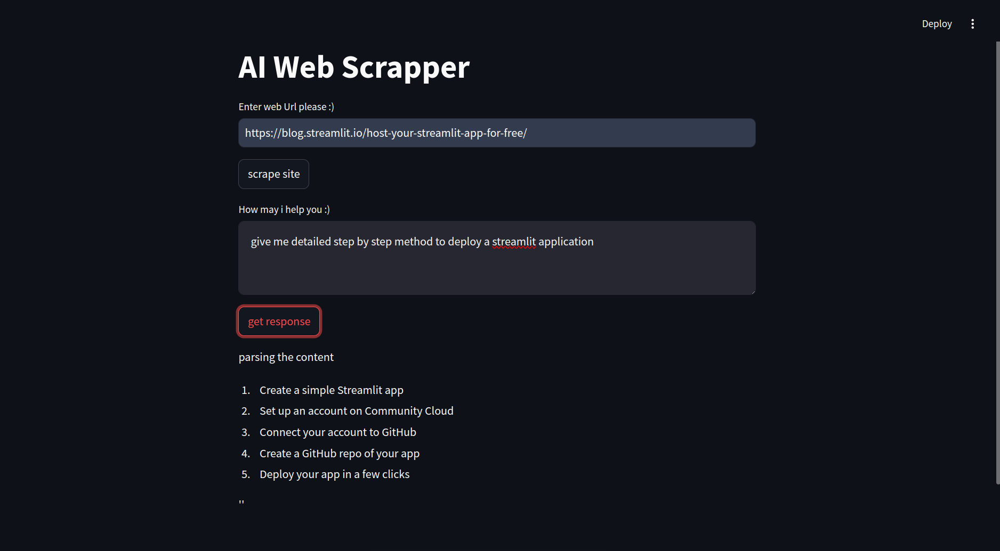

# ai-web-scrapper

> This is a Python application using selenium to scrape website content (url provided by user) processing it using beautiful-soup-4 and answering user queries using (open source) LLM model Ollama

download your supported chrome driver from [here](https://googlechromelabs.github.io/chrome-for-testing/#stable)

## prev

## Technical-Specs
- Python
- rendering : Streamlit
- Scraping : selenium
- LLM : ollama (open source)
- api provider : groq
- data extraction : beautifulsoup4

## dependencies

`/requirements.txt`